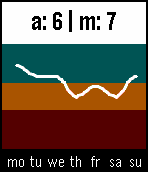

# MoodTracker

Mood Tracking for Pebble

## Description ##

  
 

This app was developed to be used as a tool with **Cognitive Behavioural Therapy** to log how the mood of the patient had been during the week.

Stores data for the last week (last 7 days). The currently stored dataset can be viewed in an overview graph when pressing the select button.

## Acknowledgement ##

Based on the <https://github.com/pebble-examples/feature-persist-counter/> example project.

The app logo and banner is based on the **Healthcare free vector** [Designed by Freepik](http://www.freepik.com/free-vector/healthcare-free-vector-banners_713583.htm).

## How to get it ##

The app is available in the Pebble App Store:

* <https://apps.getpebble.com/applications/557adc79bdeaadabcb00001b>

All released versions are also available to download here on GitHub:

* <https://github.com/alni/MoodTracker/releases>

## How to use it ##

1. Each day open the app from the Pebble App menu
2. Log how your mood has been during the day from `0` to `10`, 
   where `0` is the worst possible mood and `10` is the best possible mood.
3. If you need to change the mood after it was logged, you can change the mood at any time during the day by repeating the 
   steps `1` - `2`. Please note that you currently cannot change the mood of past days.
4. If you want to view the mood progress during the last week, click the Select (middle) button.
    * Here you can view how the mood has changed during the last week in a overview graph.
    * You can also see the average and the median for the mood during the last week.

## How to contribute ##

You can contribute by

* reporting bugs and issues, 
* request new features or changes, 
* forking the project and contributing to the code, 
* spreading the word about this project and Pebble(!)
